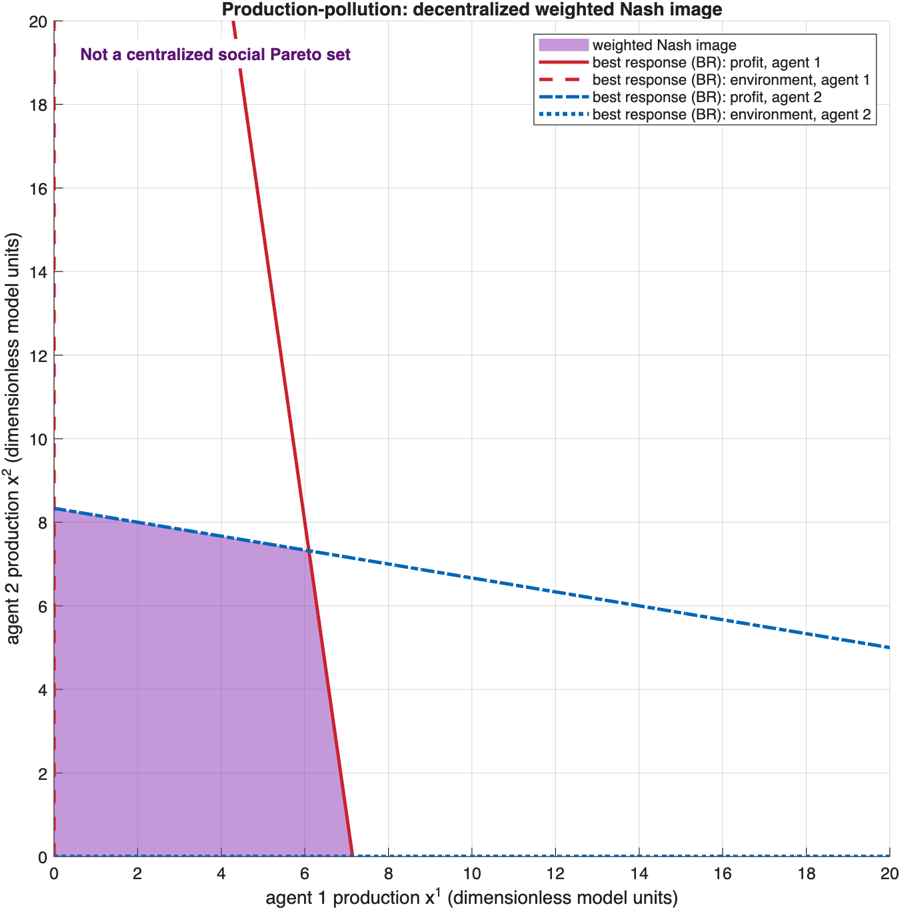
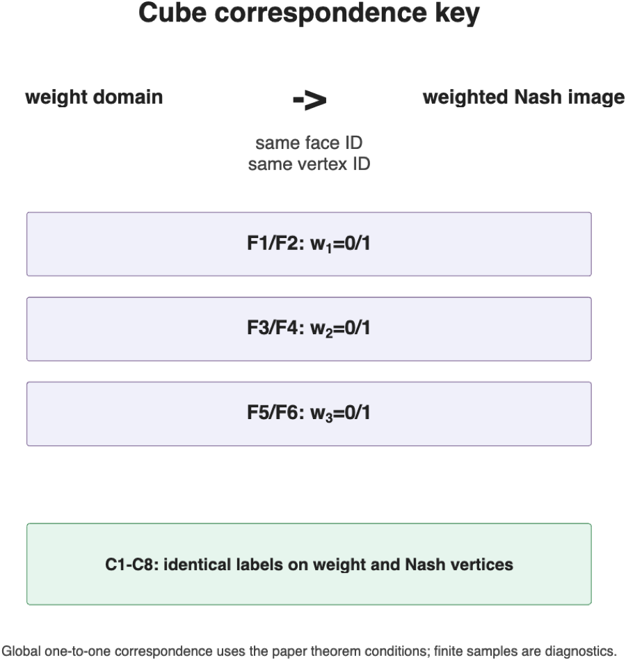
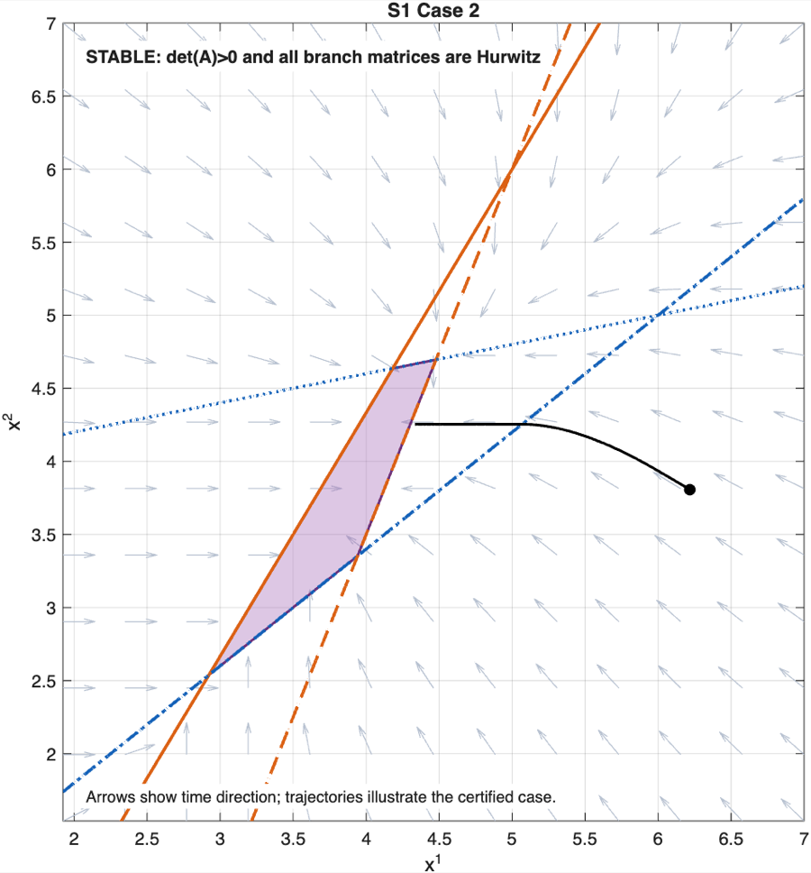
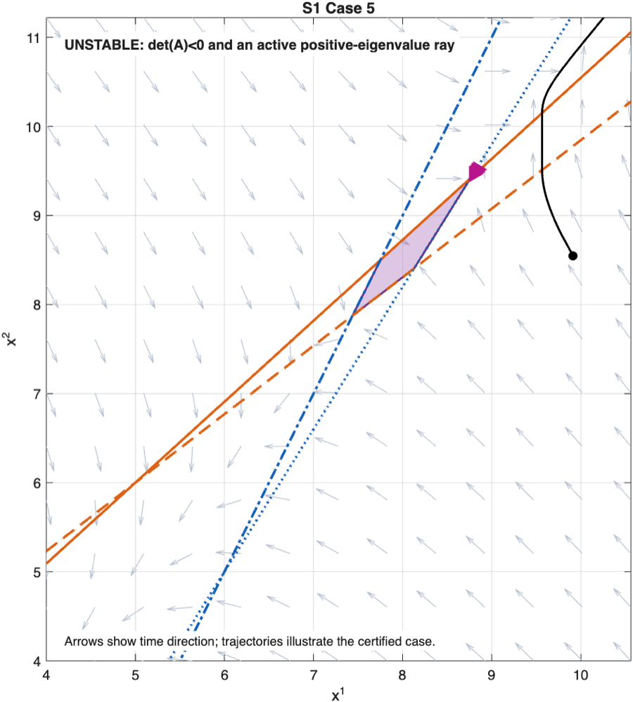
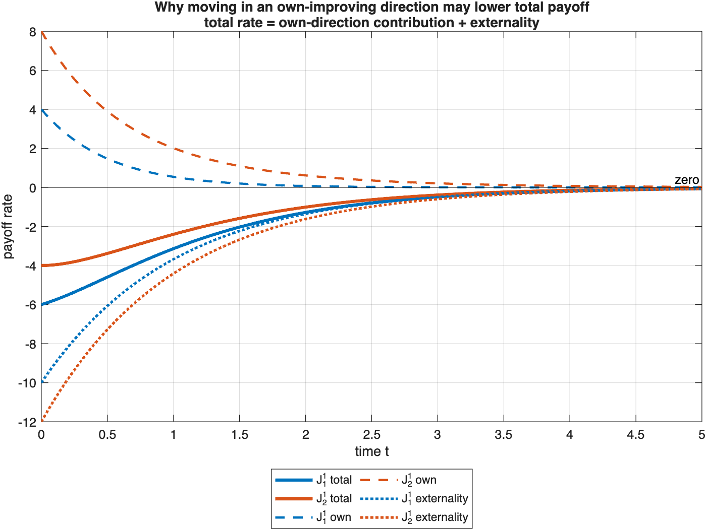
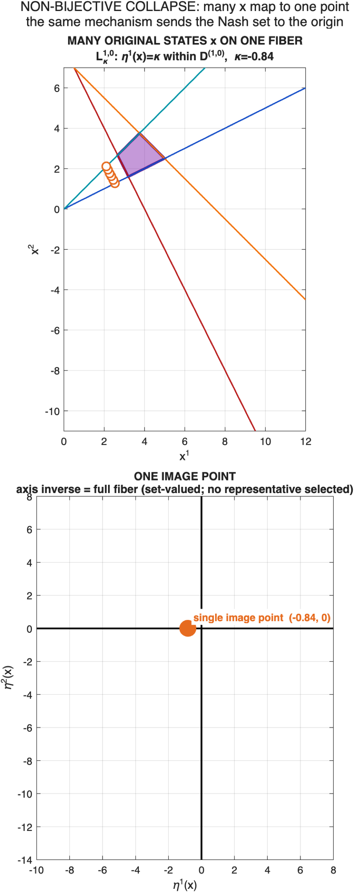
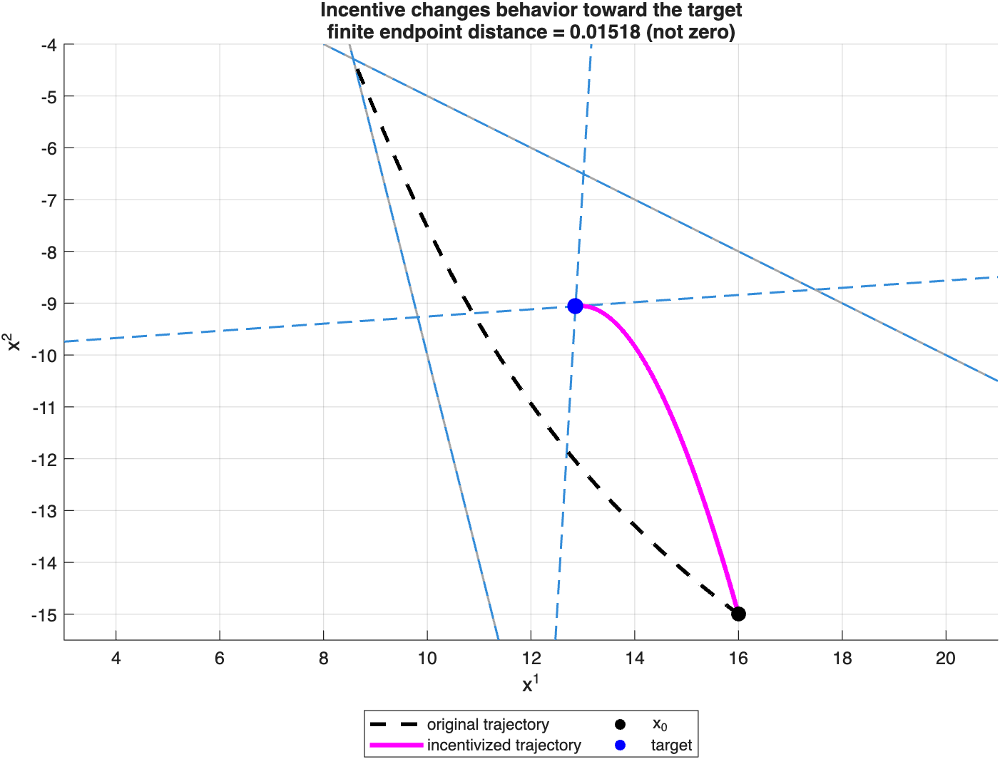

# Vector-Payoff Games: From Nash-Set Geometry to Incentive Design

In a scalar-payoff game, each agent optimizes one ordered objective. Here each
agent has several payoff components without a fixed preference between them, so
admissible objective weights generally generate a **set of Nash states**, not a
single Nash point.

This repository presents a complete, layered, and reproducible research chain
from vector-payoff Nash-set geometry to piecewise dynamics, welfare,
non-bijective representation, and conditional incentive design. It combines
paper-parameter cases, explicitly labeled new constructions, one legacy
simulation, schematics, exact calculations, independent checks, and clean
MATLAB runs without treating those evidence levels as interchangeable.

- **Geometry:** map payoff-weight domains to weighted Nash images.
- **Dynamics and welfare:** identify stable, unstable, degenerate, and
  noncompact cases, then separate own improvement from externality and total
  payoff change.
- **Representation and design:** show what a non-bijective transformation
  preserves or collapses, and test an incentive construction under explicit
  theorem conditions and a complete budget identity.



*A Nash set is not a social Pareto set. In the production--pollution example,
the purple region is the image of weighted decentralized Nash equilibria. It is
not a centralized welfare optimum.*

**Start here:** [read the research story](docs/RESULTS.md) ·
[reproduce all six experiments](docs/REPRODUCING.md) ·
[learn the notation](docs/CONCEPTS_AND_NOTATION.md)

## Why is the equilibrium a set?

For agent `i`, `J_j^i` denotes objective `j`, and `w_j^i >= 0` is an
admissible weight on that objective. A weighted scalar game asks each agent to
maximize

```text
sum_j w_j^i J_j^i(x).
```

`X*(J)` is the union of the Nash states obtained over the allowed weights. In
the quadratic T1 examples, a weight produces a state by solving

```text
M(w)x + b(w) = 0,
```

with the **same weights applied to both `M` and `b`**. Under the paper's stated
regularity conditions, this gives the weight-domain/Nash-image correspondence.
The finite grids in this repository check the implementation; they do not prove
the global one-to-one/onto statement. See
[concepts and notation](docs/CONCEPTS_AND_NOTATION.md) for the full symbol map.



*Matching face and vertex identifiers route the reader through the paper's cube
correspondence. The card is a map key, not a numerical proof of global
bijectivity.*

## The research chain

### 1. Geometry — T1

Weights generate scalarized games; their Nash states assemble into a geometric
image. Cube and prism cases retain the paper parameters, the
production--pollution case gives an application, and the nonlinear boundary
figure is explicitly schematic.

### 2. Piecewise dynamics — S1 and S2

A selected pseudo-gradient chooses one own-objective direction for each active
agent. Branch matrices, determinant signs, eigenstructure, active cones, and
theorem assumptions distinguish four stable S1 cases from one unstable case.
S2 then separates rank-degenerate stable/unstable constructions from new
noncompact constructions.



*Stable S1 representative: the analytic branch and theorem checks classify the
case; the trajectory illustrates that classification.*



*Unstable S1 representative: the active positive-eigenvalue ray is the local
witness. Visual slope or one trajectory endpoint is not the proof.*

### 3. Welfare — P1

For every payoff,

```text
total payoff rate = own-direction contribution + externality.
```

The first three P1 games keep the trajectory and own-gradient structure fixed
while changing only linear externalities. They are a new exact comparison
family: nonweak, all-payoff-nondecreasing, and weak-but-not-all. A fourth,
separate experiment uses the actual legacy scaled-own-gradient rule to exhibit
a sampled two-time weak-Pareto trap.



*Moving in an own-improving direction need not raise total payoff. The
externality from the other agent's motion is the missing term.*

### 4. Non-bijective representation — X1

The map `eta` sends two-dimensional active domains to local quadrant subsets,
one-active strips to axes, and the Nash set to the origin. An axis point can
therefore have an entire set-valued inverse fiber. The original trajectory
`x(t)`, its pointwise image `eta(x(t))`, and an independently integrated
transformed trajectory `z(t)` are three different objects.



*Many original states can share one image point. The inverse is the full fiber,
not a selected representative state; the map is an analysis device, not a
controller.*

### 5. Conditional incentive design — I1

The construction modifies only `J_1^i`, keeps target, `omega`, `sigma`,
anchoring, and budget roles explicit, and evaluates original payoffs, modified
payoffs, and aggregate transfer. `omega` is compared within the same INC-0 game;
the INC-omega supplement is a different game. The public conclusion is:

`algebra checked | trajectory observed | invariant containment unproved`



*The observed incentivized trajectory approaches the target region. This is not
an unconditional theorem guarantee because full invariant-set containment has
not been proved for the displayed parameters.*

## Reading routes

- **30 seconds:** read the opening, “Why is the equilibrium a set?”, and the
  production--pollution caption.
- **3 minutes:** add the P1 rate decomposition, the X1 fiber collapse, the I1
  condition boundary, and [provenance and limitations](docs/PROVENANCE.md).
- **15 minutes:** follow all six experiment groups in
  [Results](docs/RESULTS.md), then use the linked entry, figure, table, and audit
  records for the groups that matter to you.

The README is the public entry point. [Project state](PROJECT_STATE.md) records
current work, while the [audit](audit/AUDIT.md) explains how the reconstruction
was verified; neither is required before reading the research story.

## Results at a glance

| Group | Research question | Main public conclusion | Entry |
|---|---|---|---|
| T1 | How do payoff weights generate a Nash set? | Under the paper conditions, weight-domain structure corresponds to a weighted Nash image; Nash is not social Pareto. | [`run_t1_topology_applications`](experiments/run_t1_topology_applications.m) |
| S1 | When is the piecewise Nash set stable or unstable? | Four new cases satisfy the stable branch pattern; one retains active positive-eigenvalue witnesses. | [`run_s1_five_cases`](experiments/run_s1_five_cases.m) |
| S2 | What changes at rank degeneracy or noncompactness? | Rank-degenerate cases use Theorem 3.11; mixed determinant signs certify separate noncompact constructions via Proposition 3.1. | [`run_s2_degenerate_noncompact`](experiments/run_s2_degenerate_noncompact.m) |
| P1 | Does own improvement imply payoff improvement? | No: total change also contains externality; the legacy trap is separate finite-grid evidence. | [`run_p1_payoff_properties`](experiments/run_p1_payoff_properties.m) |
| X1 | What does a non-bijective representation preserve or collapse? | Fibers collapse, and `eta(x(t))` is not the independently integrated `z(t)`. | [`run_x1_transformation_stability`](experiments/run_x1_transformation_stability.m) |
| I1 | What can a budget-aware incentive design show? | The algebra and observed paths pass their checks, while full invariant-set containment remains unproved. | [`run_i1_incentive_budget`](experiments/run_i1_incentive_budget.m) |

Every one of the 18 technical figures has a research question, comparison,
caption, alt text, evidence statement, and “do not infer” boundary in
[Results](docs/RESULTS.md).

## Reproduce the public outputs

Tested with **MATLAB R2025b Update 7 on macOS**. Other releases have not been
verified. From a new clone at the repository root:

```bash
/Applications/MATLAB_R2025b.app/bin/matlab -batch "addpath('experiments'); run_public_reproduction"
```

The wrapper writes only below the ignored `results/public/` directory, refuses
to mix a run with old output, and produces an index for 18 figure classes and 21
nonfigure experiment-artifact classes. It does not require local PDFs, legacy
archives, or earlier result bundles. See [Reproducing](docs/REPRODUCING.md) for
requirements, alternate MATLAB paths, a custom output location, the output
schema, and interpretation boundaries.

## Provenance, limitations, and local-only material

The repository keeps theorem/paper identity, exact algebra, clean MATLAB
execution, independent numerical checks, finite sampling, and schematic
illustration distinct. Paper configurations, legacy configurations, new
constructions, and independent renderers are labeled rather than blended. Read
[Provenance](docs/PROVENANCE.md) before reusing a figure or making a stronger
claim.

`source_material/`, `reference/`, and `results/` are intentionally ignored local
directories. A new clone does not contain local PDFs, the legacy archive,
previous prototypes, or generated run bundles, and no public link in these docs
depends on them.

## Papers, citation, and license — release blockers

Formal citation metadata, author-confirmed public paper/DOI links, and a license
have **not yet been supplied**. Therefore:

- no `CITATION.cff` is fabricated;
- no local paper PDF or unconfirmed public URL is linked;
- no license is selected or created on the author's behalf; and
- the repository must not be described as ready for public release until the
  author resolves all three items.

The reconstruction work also performs no push, deployment, or publication.
