# Results: the six-part research chain

This page is the 15-minute route through all six experiment groups and all 18
tracked technical figures. Each figure states the question it answers, the
comparison it makes, what to inspect, the supported takeaway, and what must not
be inferred. Terms are defined in [Concepts and notation](CONCEPTS_AND_NOTATION.md);
generation and source categories are in [Provenance](PROVENANCE.md).

## T1 — weight domains and weighted Nash images

### 1. Cube face correspondence

- **Question:** How can a three-dimensional payoff-weight domain organize a weighted Nash image?
- **Comparison:** Cube faces and vertices versus the corresponding faces and vertices of the solved Nash image.
- **Look:** Match `F1`--`F6` and `C1`--`C8` across `weight -> solve M(w)x+b(w)=0 -> x*(w)`.
- **Takeaway:** Under the paper parameters and regularity conditions, matching identifiers expose the paper's structural correspondence.
- **Do not infer:** The finite grid or 3D view does not prove the global diffeomorphism.

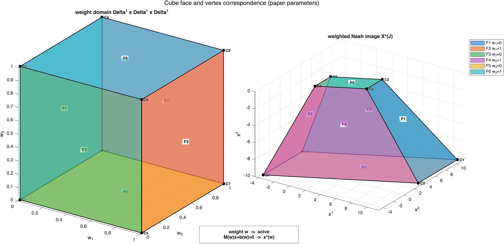

*Under the paper parameters and regularity conditions, the cube of payoff weights maps through `M(w)x+b(w)=0` to the weighted Nash image. Evidence: theorem/paper identity plus clean MATLAB implementation diagnostics.*

### 2. Triangular-prism face correspondence

- **Question:** Does the same structural reading extend beyond a cube?
- **Comparison:** Triangular-prism weight domain versus its deformed weighted Nash image.
- **Look:** Match `P1`--`P5` face labels and `P1`--`P6` vertex labels; both `M` and `b` use the same weights.
- **Takeaway:** Corresponding boundary objects remain identifiable in the paper prism case.
- **Do not infer:** A hidden face in one camera view has disappeared, or finite samples establish global bijectivity.

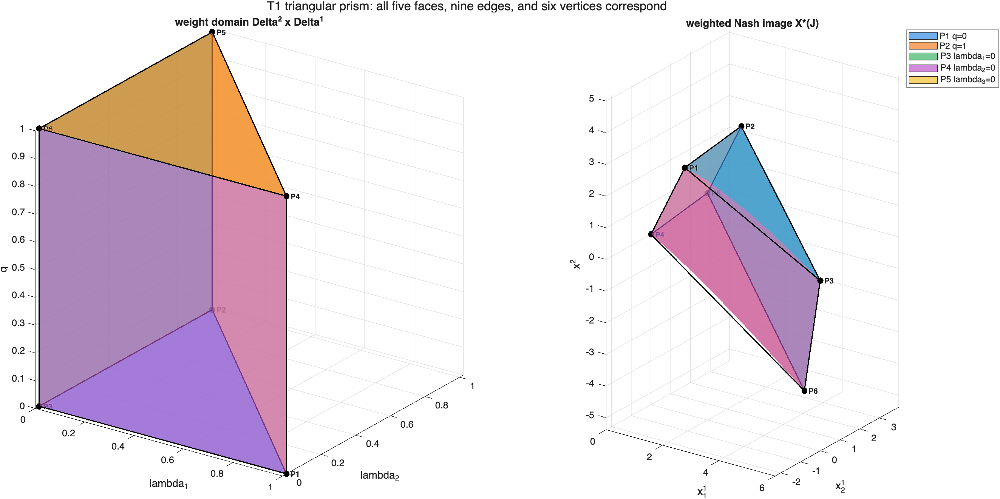

*The prism uses paper parameters and matching boundary identifiers. Evidence: theorem/paper identity plus clean MATLAB implementation diagnostics.*

### 3. Production and pollution

- **Question:** What does a weighted Nash image mean in an applied two-agent game?
- **Comparison:** Four objective-specific best-response lines and the region they bound.
- **Look:** Line style identifies profit/environment BRs; the purple area is labeled as a decentralized weighted Nash image.
- **Takeaway:** Varying each agent's objective weights produces a region of decentralized Nash states.
- **Do not infer:** That region is not a centralized social Pareto set.

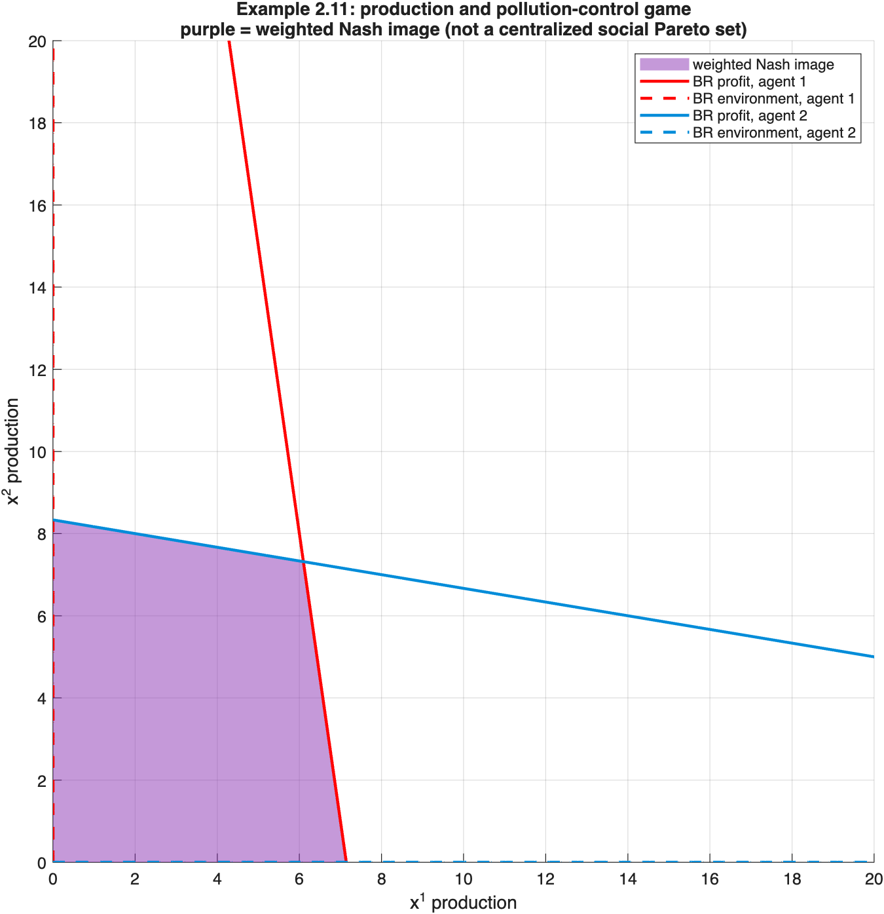

*Best-response lines for profit and environmental objectives bound the purple decentralized weighted Nash image. Evidence: exact model algebra and clean MATLAB rendering.*

### 4. Nonquadratic schematic

- **Question:** What might change when own-gradient zero sets are curved?
- **Comparison:** Styled nonlinear boundaries versus the straight BR geometry in the preceding application.
- **Look:** The prominent “schematic” label and curved enclosed region.
- **Takeaway:** Curved own-gradient zero sets can conceptually bound a curved weighted Nash image.
- **Do not infer:** No source payoff functions, parameters, or numerical reproduction are asserted.

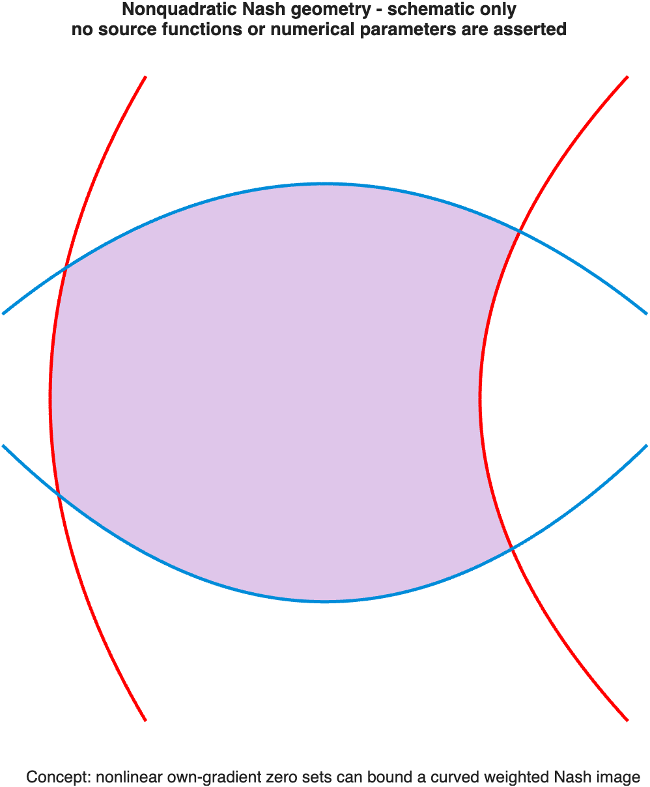

*Schematic only: nonlinear own-gradient zero sets can create a curved weighted Nash image. Evidence: schematic.*

Entry: [`run_t1_topology_applications`](../experiments/run_t1_topology_applications.m) · details: [T1 report](../audit/implementation/T1.md)

## S1 — stable and unstable piecewise dynamics

### 5. Five-case overview

- **Question:** How do branch geometry and active cones distinguish stability cases around a compact Nash set?
- **Comparison:** Four stable new cases versus one unstable new case.
- **Look:** Determinant/Hurwitz labels, transition arrows, and the magenta active positive-eigenvalue witness in Case 5.
- **Takeaway:** Slope order, all 20 branch matrices, eigenstructure, active cones, and theorem assumptions jointly establish the case identities.
- **Do not infer:** Trajectory endpoints alone do not classify a case or prove stability.

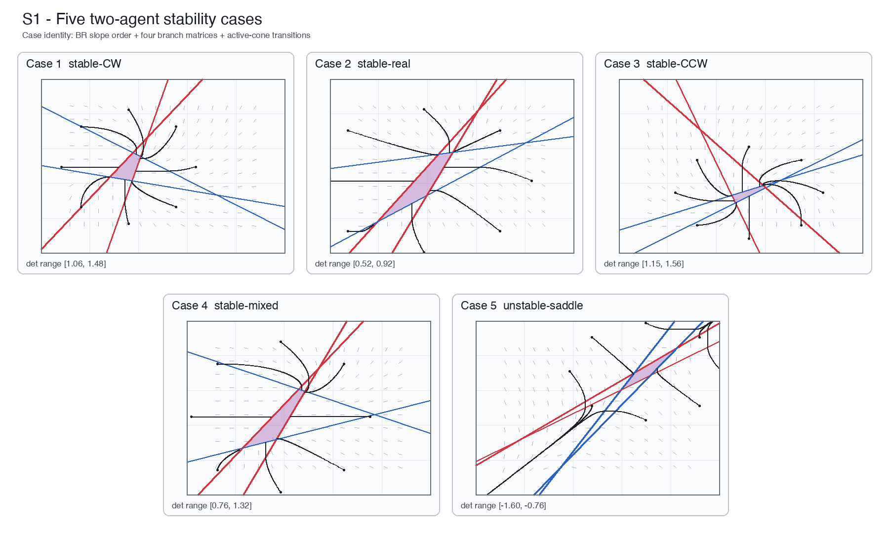

*Cases 1--4 are stable and Case 5 is unstable under the recorded branch and theorem checks. Evidence: exact branch calculations, theorem conditions, and clean MATLAB execution.*

### 6. Eigenvectors and domain transitions

- **Question:** How can local branches leave, rotate within, or remain inside an active cone?
- **Comparison:** 0-transitive, 1-transitive, 2-transitive, and unstable positive-eigenvalue geometries.
- **Look:** Black cone boundaries, gray other eigenrays, red active eigenrays, and blue local rotational flow.
- **Takeaway:** Eigenstructure plus cone membership explains local transition options and isolates the unstable witness.
- **Do not infer:** A coordinate change removes the Case-5 positive eigenvalue.

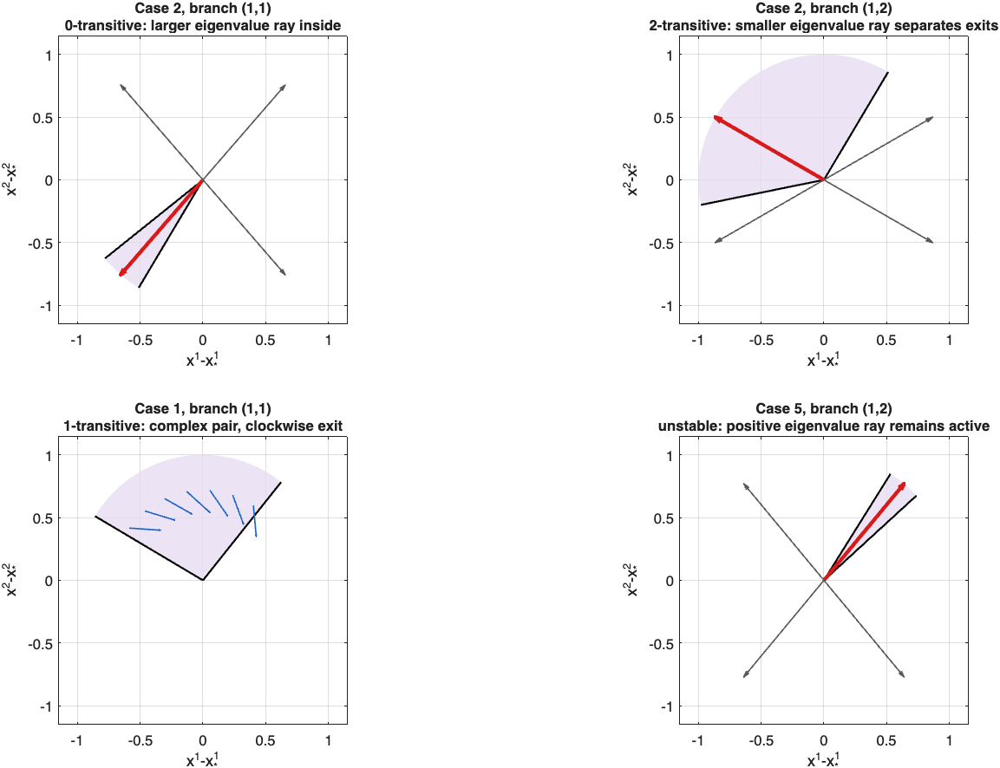

*A 0-transitive cone has no boundary exit, a 1-transitive cone has one adjacent exit, and a 2-transitive cone has two possible exits. Evidence: branch eigenstructure and active-cone calculations.*

Entry: [`run_s1_five_cases`](../experiments/run_s1_five_cases.m) · details: [S1 report](../audit/implementation/S1.md)

## S2 — rank degeneracy and noncompactness

### 7. Rank-degenerate five cases

- **Question:** What remains of the five stability identities when a same-agent BR pair pinches at a Nash point?
- **Comparison:** Four stable rank-degenerate constructions and one unstable construction under Assumption 4.
- **Look:** The gold rank-zero pinch and the determinant/Theorem-3.11 criterion in every panel.
- **Takeaway:** D1--D4 have all-positive branch determinants and are stable; D5 has all-negative determinants and is unstable under the recorded theorem hypotheses.
- **Do not infer:** These are not exact thesis parameters, and trajectories do not certify the classifications.

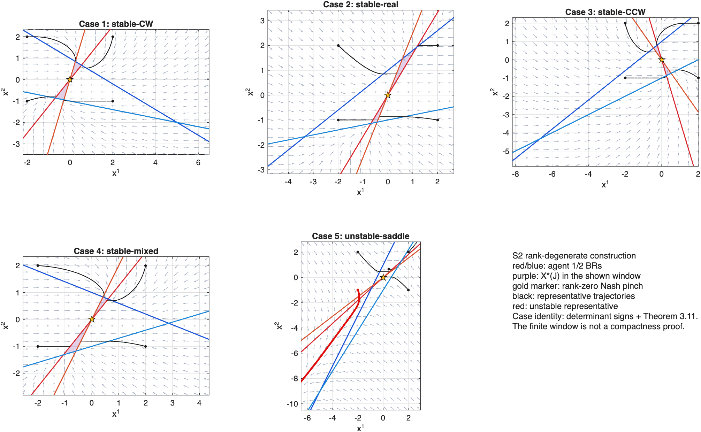

*New constructions under Assumption 4 retain the five branch identities around a rank-zero Nash pinch. Evidence: exact branch calculations, theorem conditions, and clean MATLAB execution.*

### 8. Three noncompact configurations

- **Question:** How can an unbounded Nash set be certified and visualized?
- **Comparison:** Narrow one-saddle funnel, broader three-saddle funnel, and opposite-wing constructions.
- **Look:** Mixed determinant-sign certificates and purple sampled recession directions.
- **Takeaway:** Under the recorded general-position condition, mixed branch determinant signs certify noncompactness by Proposition 3.1.
- **Do not infer:** The bounded viewport is not a compactness test, and Theorem 3.11 does not classify these mixed-sign systems.

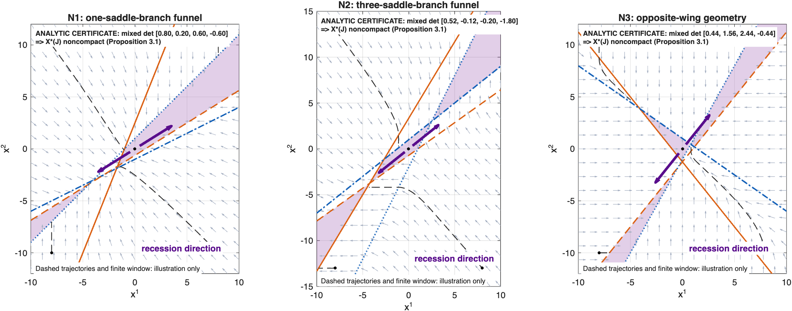

*Each new construction has an analytic mixed-sign determinant certificate; dashed trajectories and the finite plot window are illustrations. Evidence: exact algebra plus clean MATLAB rendering.*

Entry: [`run_s2_degenerate_noncompact`](../experiments/run_s2_degenerate_noncompact.m) · details: [S2 report](../audit/implementation/S2.md)

## P1 — own improvement, externality, and total payoff

### 9. Three payoff properties

- **Question:** Can the same trajectory exhibit different welfare properties when only externalities change?
- **Comparison:** Nonweak, all-payoff-nondecreasing, and weak-but-not-all games in one new exact family.
- **Look:** The fixed phase path and the sign judgments for the four total payoff rates in each row.
- **Takeaway:** Own-gradient structure does not determine total payoff change; linear externality terms separate the three properties.
- **Do not infer:** This is not an exact reproduction of thesis Fig. 4.3, and the separate trap is not one of these three identities.

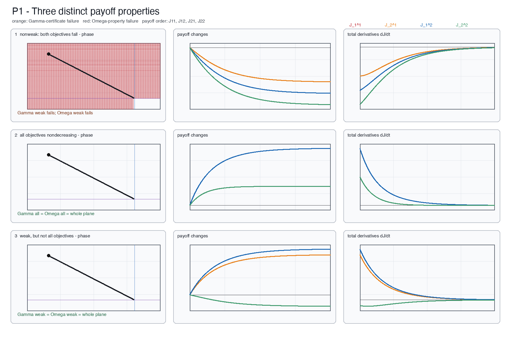

*Three new exact comparison games isolate the three payoff properties under one trajectory and own-gradient structure. Evidence: exact continuous-time algebra and clean MATLAB rendering.*

### 10. Rate decomposition

- **Question:** Which term makes an own-improving direction fail to improve the total payoff?
- **Comparison:** Own-direction contribution, externality, and their sum for every agent/objective.
- **Look:** Objective is encoded by color, term by line style, with a zero line for sign comparison.
- **Takeaway:** Total payoff rate equals own contribution plus externality; the externality can reverse the sign.
- **Do not infer:** The three curves are diagnostics of one dynamics, not three different dynamics.

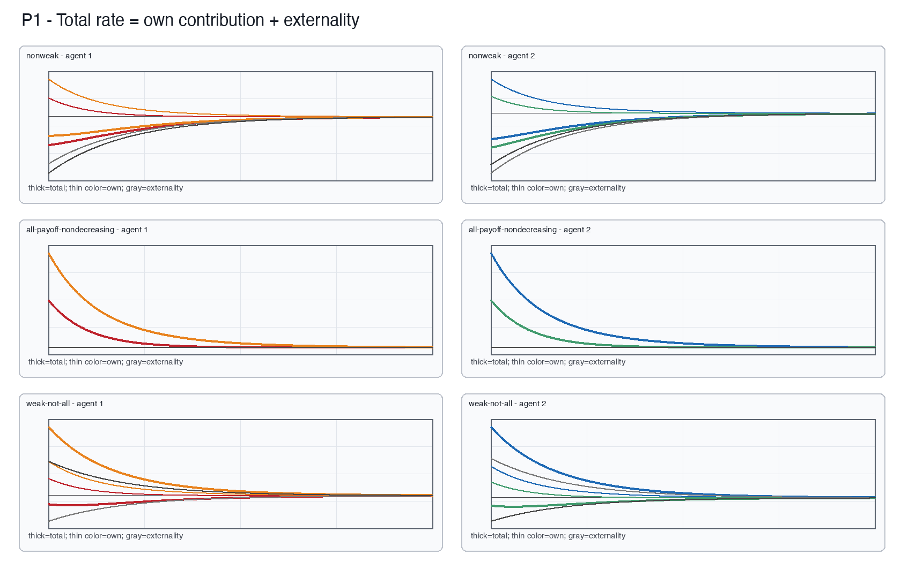

*For each payoff, total rate is decomposed into its own-direction and externality terms. Evidence: exact calculation and clean MATLAB rendering.*

### 11. Weak-Pareto trap

- **Question:** Can a trajectory satisfy a sampled instantaneous weak condition yet contain two times where both objectives of one agent are worse later?
- **Comparison:** Agent 2's two payoff components at interior times `t1=0.020` and `t2=1.820`, plus the rate decomposition along the path.
- **Look:** The two-time payoff table and separate `Gamma`-failure versus `Omega`-failure regions.
- **Takeaway:** Under the actual legacy parameters and scaled-own-gradient rule, both agent-2 payoffs are lower at the later sampled time.
- **Do not infer:** The weak-at-every-time margin is finite-grid evidence, not a continuous-time theorem, and the trap does not replace the nonweak game.

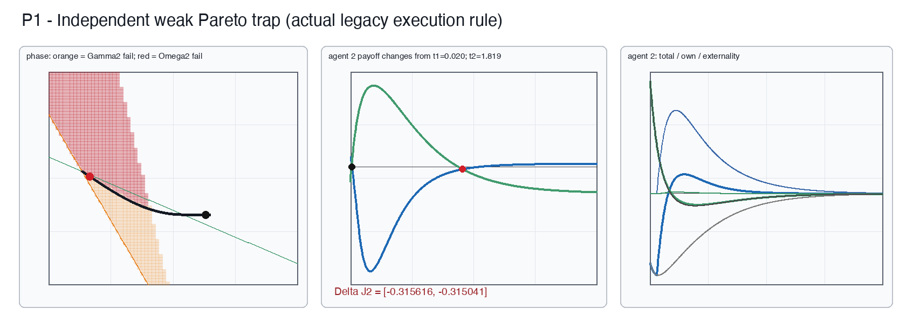

*A cross-time weak-Pareto trap under the actual legacy scaled-own-gradient rule. Evidence: clean MATLAB execution and an independent finite-grid RK4 check.*

Entry: [`run_p1_payoff_properties`](../experiments/run_p1_payoff_properties.m) · details: [P1 report](../audit/implementation/P1.md)

## X1 — non-bijective representation

### 12. Domain map

- **Question:** Where do double-active, one-active, and inactive domains go under `eta`?
- **Comparison:** The original domain partition versus its local transformed image subsets.
- **Look:** `D^(i,j)` status labels, outlined quadrant subsets, styled half-axes, and the origin.
- **Takeaway:** Two-dimensional domains map locally to quadrants, strips to axes, and the Nash set to the origin.
- **Do not infer:** The colored two-dimensional images do not claim surjectivity onto entire quadrants.

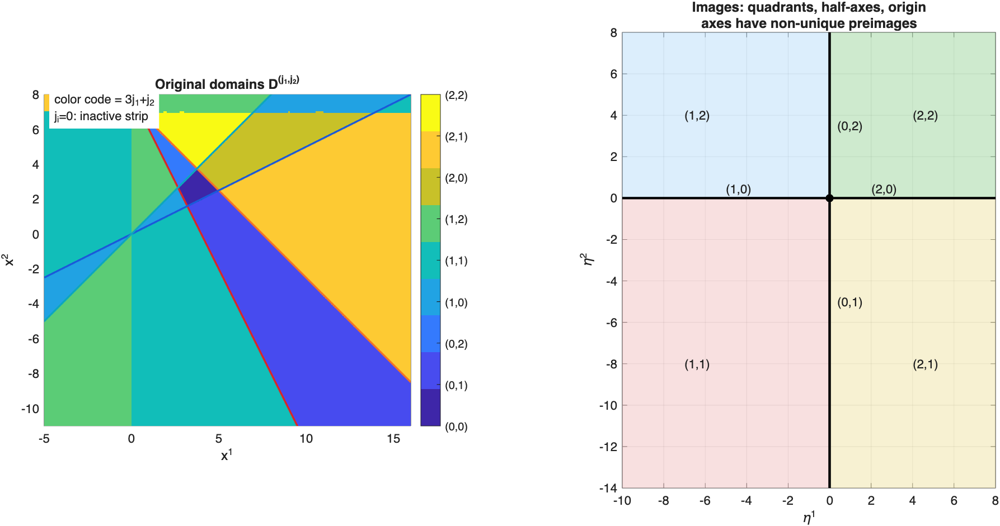

*`0` means an inactive agent; `1` or `2` names the selected objective. Evidence: the implemented paper map plus a sampled image of the displayed local window.*

### 13. Fiber collapse

- **Question:** Why does an axis image not determine one original state?
- **Comparison:** Many states on a one-active level fiber versus their one common transformed-axis point.
- **Look:** Open circles along each original-space fiber and the corresponding filled image point.
- **Takeaway:** The inverse at an axis point is the entire set-valued fiber; no representative original state is selected.
- **Do not infer:** There is no single-valued inverse on an axis.

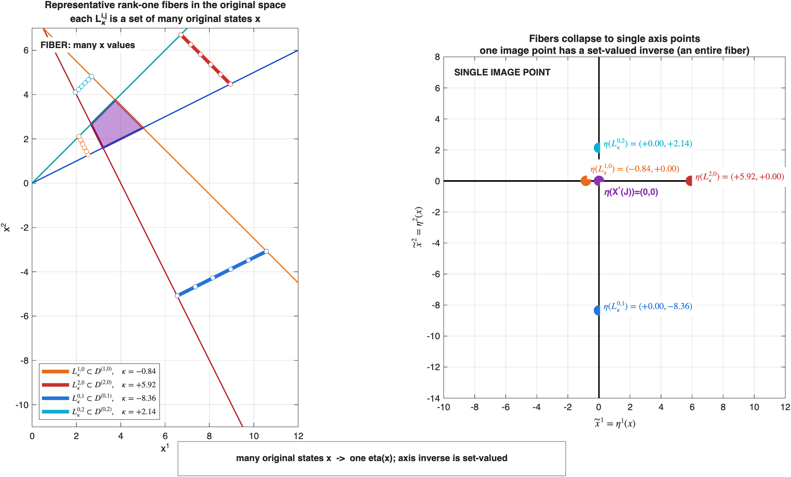

*Many original states share one axis image, and the Nash set similarly maps to the origin. Evidence: rank-one restrictions and direct map evaluation.*

### 14. Original, mapped, and independently integrated trajectories

- **Question:** Are a pointwise image and a transformed-system solution the same trajectory?
- **Comparison:** Independently integrated `x(t)`, pointwise `eta(x(t))`, independently integrated `z(t)`, and certificate values along both eta-space curves.
- **Look:** Solid circles versus dashed triangles and the A/B inset after the first one-active fiber interval.
- **Takeaway:** `eta(x(t))` and `z(t)` deliberately separate; their different provenance matters for interpretation.
- **Do not infer:** The transformation is not a controller or stabilizer, and Euclidean-norm growth alone is not an instability certificate.

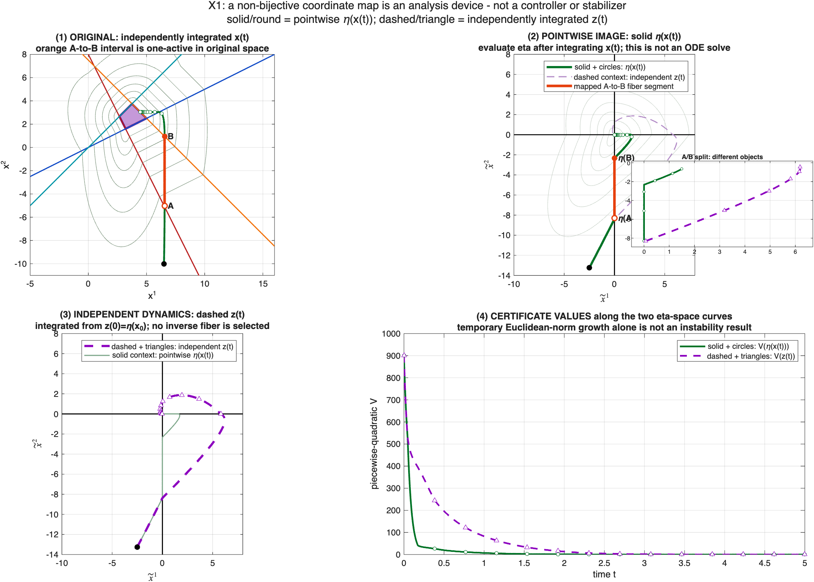

*Four distinct objects are shown, including two separate fixed-step RK4 integrations. Evidence: independent integrations, pointwise map evaluation, and verification of the printed four-branch certificate.*

Entry: [`run_x1_transformation_stability`](../experiments/run_x1_transformation_stability.m) · details: [X1 report](../audit/implementation/X1.md)

## I1 — conditional incentive design

### 15. Design geometry

- **Question:** How do target, social Pareto samples, Nash geometry, anchoring, `omega`, and behavior fit together?
- **Comparison:** Centralized social Pareto versus decentralized Nash geometry, then original versus modified design objects.
- **Look:** The numbered reading order and explicit social-Pareto/Nash legend; only `J_1^i` is modified.
- **Takeaway:** The target is the welfare maximizer, and the modified game redirects the observed behavior while retaining distinct welfare/Nash roles.
- **Do not infer:** The finite endpoint is near, not equal to, the target; the social Pareto and Nash sets are not interchangeable.

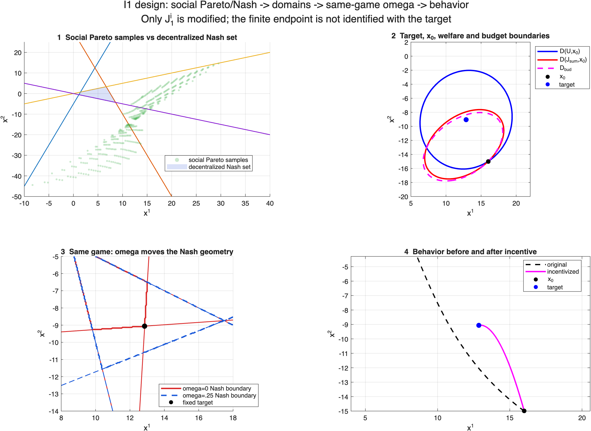

*Reading order: centralized social Pareto samples versus decentralized Nash geometry, anchored domains, same-game omega comparison, then behavior. Evidence: exact algebra and clean MATLAB execution.*

### 16. Sigma and budget topology

- **Question:** How does `sigma` change the quadratic budget-boundary topology?
- **Comparison:** Elliptic-inside, hyperbolic, and elliptic-outside regimes plus a common excluded-region explanation.
- **Look:** Orange consistently denotes `D_bud^c`, where aggregate transfer is positive, and the determinant-root regime labels.
- **Takeaway:** `sigma` changes the displayed budget geometry; the common exclusion explains a stronger certificate that fails for the shown setup.
- **Do not infer:** Failure of the stronger containment certificate is not general impossibility.

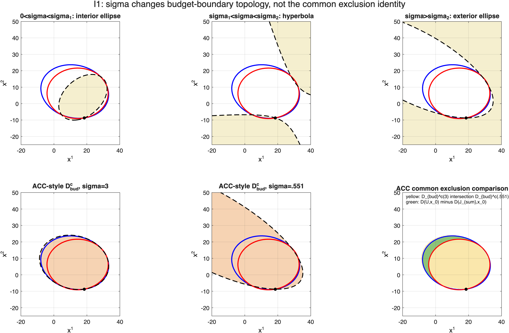

*Sigma changes the budget-boundary topology in the checked legacy game. Evidence: exact quadratic-Hessian calculation and clean MATLAB rendering.*

### 17. INC-0 before and after

- **Question:** What changes along the observed trajectory after the INC-0 incentive is applied?
- **Comparison:** Original and incentivized paths, original and modified payoff changes, and complete aggregate transfer.
- **Look:** Terminal target distance `0.0151764`, sign convention `p^1+p^2<=0`, and the three-part evidence boundary.
- **Takeaway:** The incentivized path ends near the target, and sampled aggregate transfer remains nonpositive under the stated convention.
- **Do not infer:** Full invariant-set containment remains unproved, so the display is not an unconditional theorem guarantee.

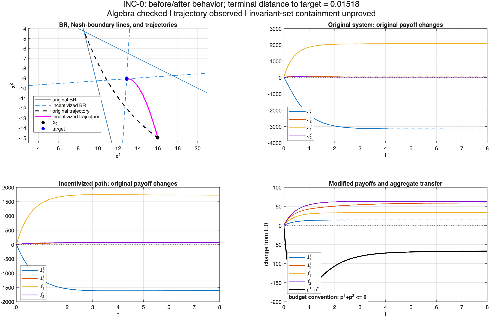

*INC-0 reports original and modified behavior with the complete budget identity: `algebra checked | trajectory observed | invariant containment unproved`.*

### 18. INC-omega supplement

- **Question:** Why must omega-weighted terms remain in the aggregate budget identity?
- **Comparison:** Weighted modified payoffs and the correct complete identity in a separate legacy game.
- **Look:** The prominent “different game” label and both omega-weighted terms.
- **Takeaway:** Omitting those terms changes the computed transfer substantively; the corrected identity is required.
- **Do not infer:** This is not a one-factor omega control against INC-0.

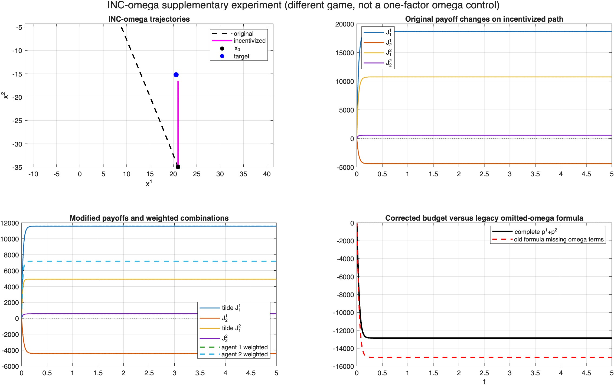

*The INC-omega supplement demonstrates the complete budget identity in a different game. Evidence: exact algebra, independent arithmetic checks, and clean MATLAB execution.*

Entry: [`run_i1_incentive_budget`](../experiments/run_i1_incentive_budget.m) · details: [I1 report](../audit/implementation/I1.md)

## Reproduce or inspect more deeply

- Run all six groups safely: [Reproducing](REPRODUCING.md).
- Understand source and evidence labels: [Provenance](PROVENANCE.md).
- Inspect how the reconstruction was verified: [R1 integrated verification](../audit/implementation/R1.md) and the [figure manifest](../audit/FIGURE_MANIFEST.md).
